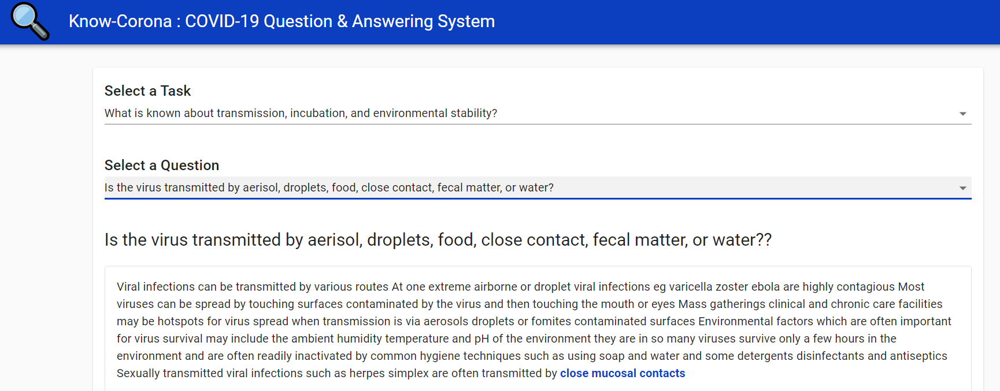

<h1 align="center">🔍 Know-Corona</h1>

NLP/state-of-the-art language model (BERT) based Question & Answering pipeline to answer all task questions after analyzing articles abstract of COVID-19, SARS-CoV-2

    

<h2 align="center">Objectives</h2>

<li>In response to the COVID-19 pandemic, the White House and a coalition of leading research groups have prepared the COVID-19 Open Research Dataset (CORD-19)</li>
<li>CORD-19 is a resource of over 52,000 scholarly articles, including over 41,000 with full text, about COVID-19, SARS-CoV-2, and related coronaviruses</li>
<li>To develop NLP based solution that can help the medical community to answer high priority scientific questions</li>

<h2 align="center">Approach</h2>

<li>Leveraged BM25 Rank function with Pre-trained BioBERT Q&A Model (SQuAD 2.0) from Transformers</li>
